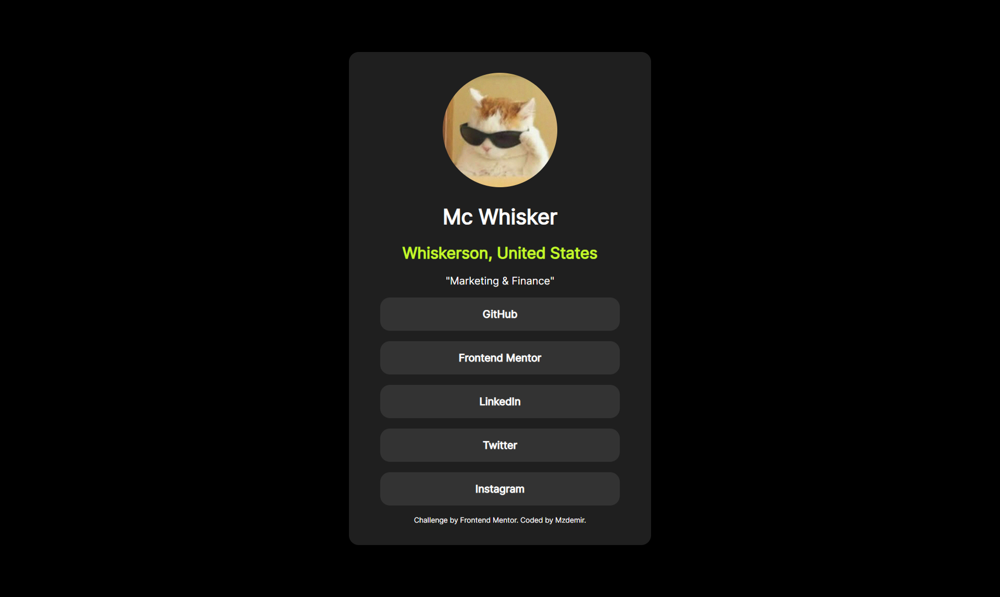

# Frontend Mentor - Recipe page solution

This is a solution to the [Recipe page challenge on Frontend Mentor](https://www.frontendmentor.io/challenges/recipe-page-KiTsR8QQKm). Frontend Mentor challenges help you improve your coding skills by building realistic projects. 

### The challenge

Users should be able to:

- See hover and focus states for all interactive elements on the page

### Screenshots

### Links

- Solution URL: 
- Live Site URL: https://mzdemir.github.io/social-links-profile/

### Built with

- Semantic HTML5 markup
- Vanilla CSS

## Author

- Website - https://mzdemir.github.io/social-links-profile/
- Frontend Mentor - https://www.frontendmentor.io/profile/mzdemir
